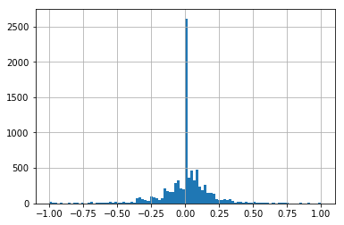

# Behavioral Cloning Project

## Ultimate goal for this project
"No tire may leave the drivable portion of the track surface. The car may not pop up onto ledges or roll over any surfaces that would otherwise be considered unsafe (if humans were in the vehicle)."

---

The goals / steps of this project are the following:
* Use the simulator to collect data of good driving behavior
* Build, a convolution neural network in Keras that predicts steering angles from images
* Train and validate the model with a training and validation set
* Test that the model successfully drives around track one without leaving the road
* Summarize the results with a written report

---
### Files Submitted & Code Quality
#### 1. Submission includes all required files and can be used to run the simulator in autonomous mode

My project includes the following files:
* model.py containing the script to create and train the model
* drive.py for driving the car in autonomous mode
* model.h5 containing a trained convolution neural network 
* writeup_report.md or writeup_report.pdf summarizing the results
* video.mp4 recording the autonomous driving of track 1

#### 2. Submission includes functional code
Using the Udacity provided simulator and my drive.py file, the car can be driven autonomously around the track by executing 
```
python drive.py model.h5
```

#### 3. Submission code is usable and readable
The model.py file contains the code for training and saving the convolution neural network. The file shows the pipeline I used for training and validating the model, and it contains comments to explain how the code works.

### Model Architecture

#### 1. An appropriate model architecture has been employed
I'm using the model in nVidia's paper with slight modification. 

The model (line 107 to 123) starts with a Lambda layer for normalization and a Cropping2D layer for cropping unnecessary backgrounds.

Followed are 5 Conv2D layers. The first 3 have depth of 24, 36, 48 with 5 by 5 kernel size and 2 by 2 stride. The last 2 layers both have depth of 64 with 3 by 3 kernel size. All 5 conv layers have ReLU activations.

The model then includes 4 Dense layers. The first two Dense layers are followed by a Dropout layer with probability of 0.5 to reduce overfitting. 

#### 2. Attempts to reduce overfitting in the model
The model contains dropout layers in order to reduce overfitting (lines 119 & 121). 

The model was trained and validated on different data sets to ensure that the model was not overfitting. The model was tested by running it through the simulator and ensuring that the vehicle could stay on the track.

#### 3. Model parameter tuning
The model used an adam optimizer, so the learning rate was not tuned manually and by default it's 0.001.

#### 4. Appropriate training data

Training data was chosen to keep the vehicle driving on the road. I used a combination of center lane driving and one lap of recovery driving. 

### Training Strategy
#### 1. Solution Design Approach
My first step was to use a convolution neural network model similar to the nVidia one. It's a proven model that works relatively well in the real world. It's also easy to implement and train the data.

As usual, I split the data into training and validation sets. The first few training showed weird result that both training and validation losses stayed similar to 0.05 for all 5 epochs. This basically says it's not learning at all. 

After consulting peers and googling online, I found the issues:
1. recording training data with keyboard generates discrete values
2. there are too many zero steering angle values in the training data

Below is the distribution of steering angles before any processing:



Here's what I did to overcome those issues:
1. use joystick to generate continuous steering angles
2. randomly skip zero values from training data to make the distribution more Gaussian-like

At the end, the vehicle is able to drive autonomously around the track without leaving the road.

#### 2. Final Model Architecture
This is detailed in the last section.

#### 3. Creation of the Training Set & Training Process
I recorded several types of training data:
1. three laps center lane driving clockwise on track 1
2. three laps center lane driving counter-clockwise on track 1
3. one lap recovery driving on track 1
4. three laps center lane driving clockwise on track 2
5. three laps center lane driving counter-clockwise on track 2

I ended up only used the first 3 data sets due to memory shortage on the computer. The total number of original data points is: 

Then on `model.py` line 58, I augmented all the data with horizontal flips. Now the number of data points is doubled to 

Then I split the augmented data to 80% training and 20% validation sets with `scikit-learn`'s `train_test_split` method.

Then I train the model with the data with Adam optimizer and mean-square-error loss function with batch size of 32 and 5 epochs. 


